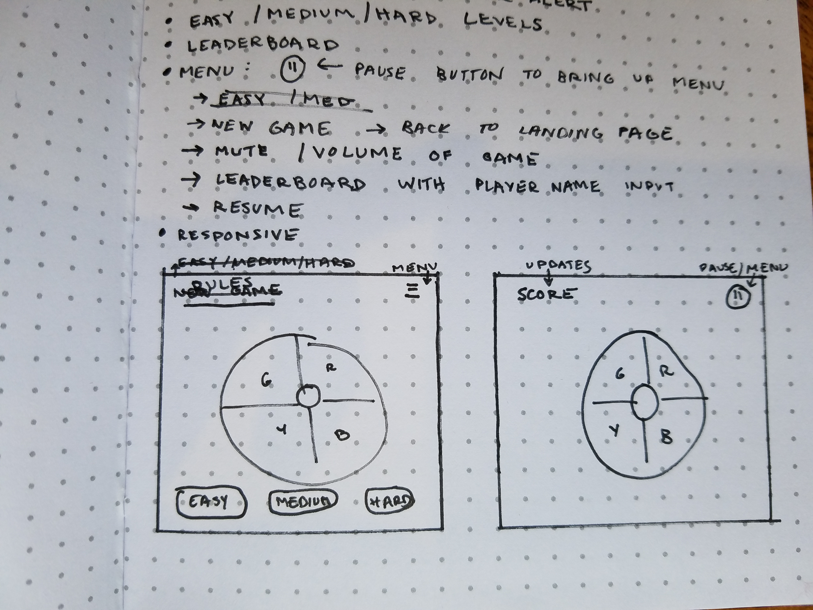

# Simon - Project 1
General Assembly Project 1: Simon Game

---

This web app is based on the electronic memory game, Simon. Simon has been made in the United States since 1978. Originally created by Milton Bradley, the game is now owned by Hasbro. This specific web app uses Star Wars themed tones. Each round adds a new action to Simon for the player to recreate. This continues until the player is not able to match the pattern.

https://romantic-noyce-22c5fa.netlify.com/

---

### Link to Trello Board
https://trello.com/b/CCZIcDem/simon-project-1

### Wireframes

### Technologies Used:
* HTML
* CSS
* Javascript
* jQuery

---

### Ideas for Next Update

The next update will be styled to keep with the Star Wars theme.
A leaderboard to keep the top 3-5 scores will replace the single top score.
A menu button to control the sound of the game will also be added.
The rules will also be available in the menu.
Allow user to start new game without refreshing the page.